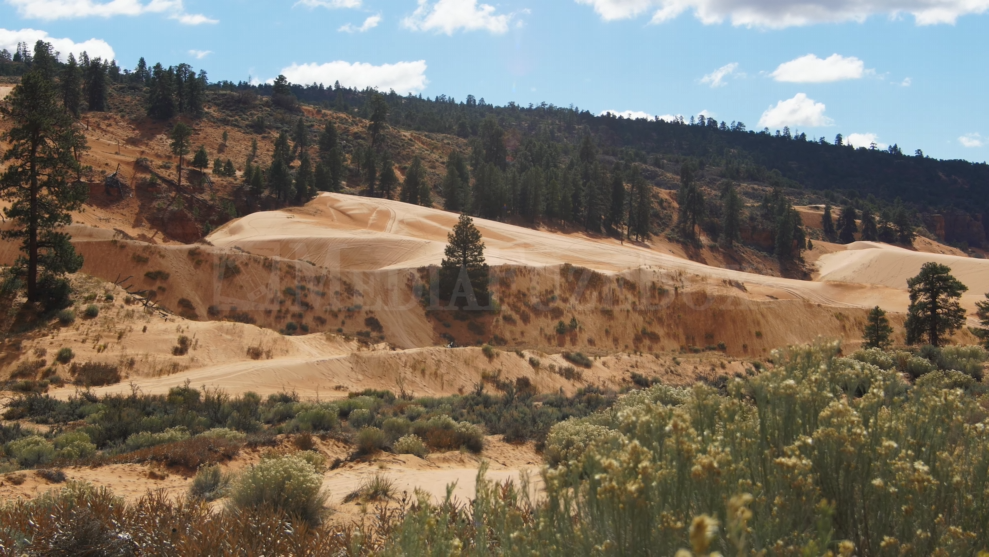
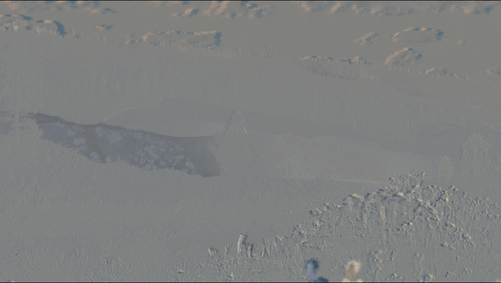

# FStract-Video
Enhance your videos with dynamic motion trails!

# Motion Trail Video Processing Script

This Python script applies a motion trail effect to a given video file using FFmpeg. It enhances the visual representation of motion in the video by creating a trailing effect behind moving objects. Additionally, the script allows for color inversion and opacity adjustments for creative video effects.

## Features

- Creates a motion trail effect on moving objects in the video.
- Inverts colors of the processed video for a unique visual experience.
- Allows customizing the blend mode, frame step, playback speed, and opacity of the motion trail.

## Requirements

- Python 3.7 +
- FFmpeg installed and accessible in the system's PATH.

## Examples

Below are examples showing the input and output of the script:

### Input


### Output


## Installation

Before running the script, ensure that Python and FFmpeg are installed on your system.

1. **Clone the Repository**:
   ```sh
   git clone [repository-url]
   ```
2. **Navigate to the Script Directory**:
   ```sh
   cd [directory-name]
   ```

## Usage

Run the script from the command line, providing the required video file and optional arguments to customize the effect.

```sh
python script_name.py <input_video> [options]
```

### Arguments

- `input_video`: Path to the input video file.
- `--blend_mode`: Blend mode for the `tblend` filter (default: 'average').
- `--frame_step`: Number of frames to skip for the motion trail (default: 2).
- `--pts_multiplier`: Multiplier for adjusting the playback speed (default: 0.5).
- `--opacity`: Opacity of the motion trail video (default: 0.5).

### Example

```sh
python script_name.py input_video.mp4 --blend_mode average --frame_step 2 --pts_multiplier 0.5 --opacity 0.5
```

## Output

The script produces an output video file with the motion trail effect applied. The file will be saved in the same directory as the script.

## License

MIT LICENCE
